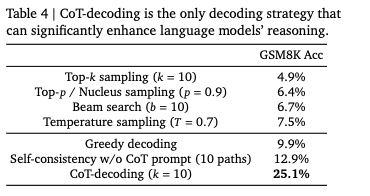

# CoT-Decoding

논문 **"Chain-of-Thought Reasoning without Prompting"** (Wang & Zhou, 2024)의 Table 4를 재현하고, 다양한 모델/데이터셋에서 디코딩 전략별 성능을 비교할 수 있도록 구현했습니다.

프롬프트 엔지니어링 없이, **디코딩 방식만 바꿔서** LLM의 내재된 Chain-of-Thought 추론 경로를 이끌어내는 방법.

## 핵심 아이디어

기존 greedy decoding은 모델이 바로 답을 출력하지만, 첫 토큰 위치에서 **top-k 대안 토큰을 탐색**하면 CoT 추론 경로가 숨어 있음을 발견.

```
입력: "Q: 1+2*3=? A:"

Greedy (top-1):  " 9"  → 바로 답 (틀림)
Top-6:           " Let me think..." → "1+2*3 = 1+6 = 7" (맞음, 높은 Δ)
```

CoT 경로는 답변 토큰에서 **confidence(Δ = P(top1) - P(top2))가 높으므로**, 이를 기준으로 최적 경로를 자동 선택.

## 구조

```
cot_decoding/
├── cot_decoding.py   # 핵심 알고리즘 (범용)
├── run_table4.py     # Table 4 재현 실험 (GSM8K / KMMLU)
├── visualize.py      # 결과 시각화
└── README.md
```

## 설치

```bash
pip install torch transformers datasets tqdm matplotlib
```

## 사용법

### 기본 (MCQA)

```python
from cot_decoding import cot_decoding, MCQAExtractor

extractor = MCQAExtractor(choices=["A", "B", "C", "D"])
path = cot_decoding(model, tokenizer, input_ids, k=10, extractor=extractor)
print(path.answer, path.delta)
```

### 자유응답 (GSM8K 스타일)

```python
from cot_decoding import cot_decoding, FreeFormExtractor

extractor = FreeFormExtractor()  # 숫자 추출
path = cot_decoding(model, tokenizer, input_ids, k=10, extractor=extractor)
print(path.answer)  # "42"
```

### Yes/No

```python
from cot_decoding import cot_decoding, YesNoExtractor

extractor = YesNoExtractor()
path = cot_decoding(model, tokenizer, input_ids, k=10, extractor=extractor)
print(path.answer)  # "yes" or "no"
```

### 커스텀 태스크

```python
from cot_decoding import AnswerExtractor, cot_decoding

class MyExtractor(AnswerExtractor):
    def extract(self, text):
        # 답변 추출 로직
        ...

    def get_stop_token_ids(self, tokenizer):
        # early stopping 토큰 (없으면 빈 set 반환)
        return set()

extractor = MyExtractor()
path = cot_decoding(model, tokenizer, input_ids, k=10, extractor=extractor)
```

## 디코딩 전략 비교 (Table 4 재현)

```bash
# GSM8K + Llama-3.1-8B (논문 원본 설정, 자유응답)
python run_table4.py --dataset gsm8k --model meta-llama/Llama-3.1-8B \
  --num_samples 200 --output_dir ./results_gsm8k

# KMMLU + kanana-8b (한국어 MCQA)
python run_table4.py --dataset kmmlu --model kakaocorp/kanana-1.5-8b-base \
  --num_samples 200 --output_dir ./results_kmmlu

# 특정 전략만
python run_table4.py --dataset gsm8k --num_samples 10 --strategies greedy cot_decoding

# 시각화
python visualize.py ./results_gsm8k
```

### 논문 원본 결과 (Mistral-7B, GSM8K)



### 지원 전략

| 전략 | 설명 |
|---|---|
| `greedy` | Greedy decoding |
| `temperature_sampling` | Temperature sampling (T=0.7) |
| `top_k_sampling` | Top-k sampling (k=10) |
| `nucleus_sampling` | Top-p / Nucleus sampling (p=0.9) |
| `beam_search` | Beam search (b=10) |
| `self_consistency` | Self-consistency w/o CoT prompt (10 paths) |
| `cot_decoding` | CoT-decoding, max Δ path (k=10) |
| `cot_decoding_agg` | CoT-decoding, weighted aggregation (k=10) |

## 알고리즘

1. 프롬프트를 1회 forward → KV cache 생성
2. 첫 토큰 위치에서 top-k 대안 토큰 추출
3. 각 대안에서 greedy decoding (KV cache 분기)
4. 답변 토큰 위치의 Δ = P(top1) - P(top2) 계산
5. Δ가 최대인 경로의 답변을 반환

### Aggregation 변형

```
Δ̃_a = Σ_k Δ_{k,a}   (답변이 a인 모든 경로의 Δ 합산)
```

## 최적화

- **KV cache 공유**: 프롬프트 처리 1회, k개 경로가 base KV cache에서 분기
- **Early stopping**: 태스크별 stop 토큰 발견 시 즉시 생성 중단
- **토큰 ID 캐싱**: stop 토큰 ID를 한 번만 계산 후 재사용

## 참고

- 논문: [Chain-of-Thought Reasoning without Prompting](https://arxiv.org/abs/2402.10200)
- 모델: `meta-llama/Llama-3.1-8B`, `kakaocorp/kanana-1.5-8b-base`
- 데이터셋: [openai/gsm8k](https://huggingface.co/datasets/openai/gsm8k), [HAERAE-HUB/KMMLU](https://huggingface.co/datasets/HAERAE-HUB/KMMLU) (Math)
